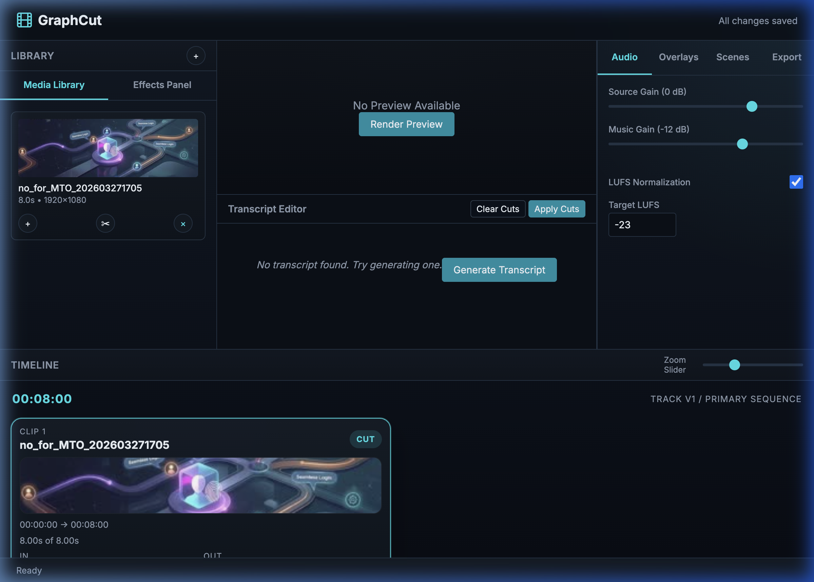

<div align="center">
  
  
  # GraphCut 🎬✂️

  **The Local-First, Automation-Powered Video Editor for Solo Creators**
  
  <p>
    <a href="https://github.com/colleybrb/graphcut/stargazers"></a>
    <a href="https://github.com/colleybrb/graphcut/blob/main/LICENSE"></a>
    <a href="https://www.python.org/downloads/"></a>
    <a href="#"></a>
    <a href="#"></a>
  </p>
</div>

---

**GraphCut** is a blistering-fast, privacy-respecting video editor aimed at solo creators who want the speed of automation with the raw power of Python and FFmpeg. 

Tired of waiting for cloud processing? Frustrated by bloated timelines for simple tasks? GraphCut effortlessly merges multiple clips, overlays webcams, mixes audio, syncs offline AI transcriptions, and generates burn-in captions natively on your own machine. 

## ✨ Why GraphCut?

* 🔒 **100% Local-First:** All editing, rendering, and AI transcription happens offline. No media or transcripts are ever sent to a cloud endpoint.
* ⚡ **Hardware Accelerated:** Automatically detects CPU vs. NVENC (NVIDIA CUDA) vs. VideoToolbox (Mac) and uses the best available native hardware acceleration to slice render times. 
* 🧠 **AI Transcription Built-in:** Features local Whisper AI integrations for hyper-fast, word-accurate transcription and caption burn-in out of the box.
* 💻 **Code as the Editor:** No proprietary, corruptible binary project formats. Your project manifest is a standard, human-readable YAML file that statically drives FFmpeg filtergraphs.
* 🚀 **Automation Ready:** Every single GUI or CLI action translates directly to programmable backend rendering functions. Build your own mass-rendering loops or integrate with your existing automation suites.

## 🤖 Built for AI Agents

Because GraphCut is entirely deterministic and backed by simple JSON/YAML manifests, **it is the ultimate video editor for AI coding agents.**

Instead of wrestling with headless browsers or proprietary GUI scripting, an AI agent can simply:
1. Ingest your raw footage.
2. Generate a `project.yaml` containing precise cut timestamps, overlay logic, and styling.
3. Run `graphcut export my-video` via the CLI.

Zero GUI required. You can completely automate your video pipeline—letting your locally running LLMs assemble, narrate, and polish YouTube or TikTok clips while you sleep!

### Agent-Friendly CLI (Recommended)

GraphCut includes a set of timeline commands designed for automation and AI agents.

Key ideas:
* `sources` and `timeline list` can emit machine-readable JSON (`--json`)
* timeline indices are **1-based**
* multi-trim assembly is done by adding many segments from one source via repeatable `--range START:END`

#### Inspect Inputs (JSON)

```bash
# List sources (machine-readable)
graphcut sources my-awesome-video --json

# List timeline clips (machine-readable)
graphcut timeline list my-awesome-video --json
```

#### Build a Multi-Trim Timeline

```bash
# Clear and rebuild the timeline as a set of trimmed segments
graphcut timeline clear my-awesome-video

# Add multiple segments from a single source (repeat --range) and apply a fade transition
graphcut timeline add my-awesome-video main_clip --range 12.40:21.05 --range 45.10:58.00 --transition fade

# Add one more segment using --in/--out
graphcut timeline add my-awesome-video main_clip --in 95.50 --out 105.25

# Move / split / trim / delete
graphcut timeline move my-awesome-video 4 2
graphcut timeline split my-awesome-video 2 50.00
graphcut timeline trim my-awesome-video 1 --in 0.50 --out 10.00
graphcut timeline delete my-awesome-video 3

# Apply crossfade or dissolve transitions between clips dynamically
graphcut timeline transition my-awesome-video 1 xfade --duration 0.6
graphcut timeline transition my-awesome-video 2 fade

# Discover all built-in transition types and effects
graphcut effects list

# Review the timeline
graphcut timeline list my-awesome-video
```

#### Set Roles (Narration/Music) and Scenes

```bash
# Assign audio roles (source IDs must exist)
graphcut roles my-awesome-video --narration voiceover_1 --music background_audio

# Save/activate scene snapshots (webcam/audio/captions/roles)
graphcut scene save my-awesome-video TalkingHead
graphcut scene activate my-awesome-video TalkingHead
graphcut scene list my-awesome-video
```

#### Render / Export

```bash
# Fast local preview
graphcut render-preview my-awesome-video

# Export to a preset
graphcut export my-awesome-video --preset YouTube --quality final
```

### Example Agent Actions

```bash
# Automatically transcribe speech and burn-in subtitles
graphcut transcribe my-awesome-video

# Automatically chop out all dead-air silence from the timeline
graphcut remove-silences my-awesome-video --min-duration 1.0

# Configure a picture-in-picture webcam overlay over the main footage
graphcut set-webcam my-awesome-video face_cam.mp4 --position bottom-right

# Generate a fast draft preview 
graphcut render-preview my-awesome-video
```

## 📸 Interactive Web GUI

GraphCut isn't just a CLI script. It features a full, decoupled native Web UI designed to edit video from the browser without the lag.

> *Edit transcripts like a text document to automatically cut the underlying video! Manage scenes, tweak audio mixing, apply transition overlays, and stream native rendering previews — all powered by a FastAPI backend.*

## 🛠️ Installation

**Prerequisites:** You must have Python 3.11+ installed. (Note: `ffmpeg` is automatically bundled via `static-ffmpeg` so you don't even need admin rights on Windows!)

```bash
# Clone the repository
git clone https://github.com/colleybrb/graphcut.git
cd graphcut

# Full suite install (Includes Local AI Whisper transcription & Scene Detection)
pip install -e ".[all]"
```

## 🚀 Quick Start

Creating a polished, captioned video takes just a few commands.

```bash
# 1. Initialize a new video project directory
graphcut new-project my-awesome-video

# 2. Add raw media (video, webcam, audio) to the project
graphcut add-source my-awesome-video main_clip.mp4 background_audio.mp3

# 3. Boot up the local Web GUI editor to start cutting
graphcut serve my-awesome-video
```

Navigate to `http://localhost:8420` in your web browser. Upload your media, hit **Generate Transcript**, delete the words you don't want, and click **Export** to render YouTube, TikTok, and Reels formats simultaneously!

*(Note: If your system doesn't recognize the `graphcut` command, simply prefix it with `python -m graphcut.cli` like `python -m graphcut.cli serve my-awesome-video`!)*

**Corporate Firewalls / VPNs:**
If you are on a locked-down enterprise laptop that is blocking the automatic FFmpeg bundled download, you can explicitly pass your company's network proxy:
```bash
graphcut serve my-awesome-video --proxy http://proxy.corp.local:8080
```

## 🏗️ Architecture

Under the hood, GraphCut completely bypasses slow per-frame Python processing (like MoviePy or OpenCV). Instead, it orchestrates complex `FFmpeg` filtergraphs via `subprocess`, delivering maximum bare-metal rendering performance. 

* **Backend:** FastAPI, Python 3.11+, Pydantic v2
* **Frontend:** Vanilla JS, CSS Grid (Dependency-free HTML5)
* **AI:** `faster-whisper` (CUDA/Metal supported!)

## 🤝 Contributing & License

GraphCut is licensed under the **Fair Source License**. 

The codebase is completely open, transparent, and **free for any personal, educational, or non-commercial usage indefinitely.** If you use GraphCut to produce content that generates revenue over a certain threshold, or deploy it within a corporate environment, please see [LICENSE.md](LICENSE.md) for commercial licensing requirements.

**Love the project? Please consider leaving a ⭐ on GitHub!**

## 🔧 Troubleshooting

**"graphcut: command not found"**

If you run `graphcut` and your terminal says it is not recognized, check the following:
1. **Watch your spelling:** Make sure you are typing `graphcut`, not `grphacut`.
2. **Python PATH Issues:** Depending on your OS, `pip install` might place executables in a folder that isn't on your system's `$PATH` (like `~/.local/bin` on Linux/Mac, or `C:\Users\Name\AppData\Local\Programs\Python\Scripts` on Windows). You'll need to add that directory to your PATH variable.
3. **Alternative Execution:** If you can't get your path configured, you can always execute the python module directly from within the cloned directory by running:
   ```bash
   # Initialize instead of 'graphcut new-project'
   python -m graphcut.cli new-project my-video
   
   # Boot the GUI instead of 'graphcut serve'
   python -m graphcut.cli serve my-video
   ```
