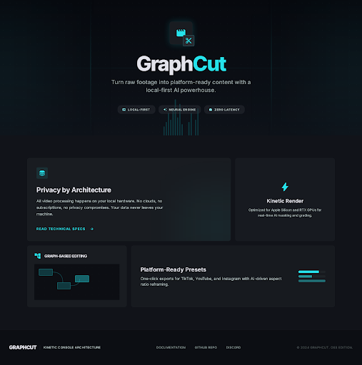
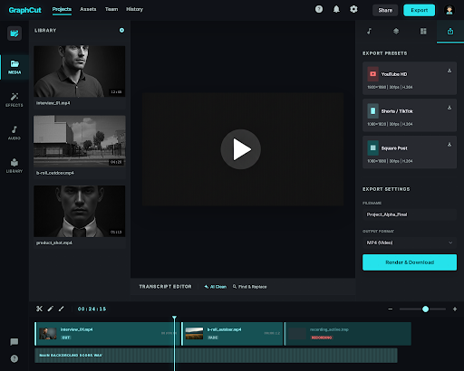
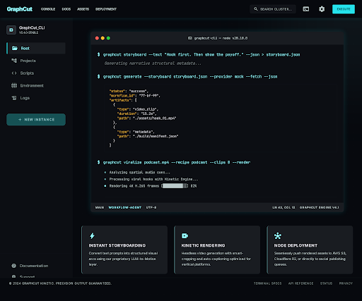

<div align="center">
  <br/>
  
  <br/><br/>

  # GraphCut 🎬✂️

  **The local-first video editor that turns raw footage into platform-ready content — and packages it for posting.**

  <p>
    <a href="https://github.com/colleybrb/graphcut/stargazers"></a>
    <a href="https://github.com/colleybrb/graphcut/network/members"></a>
    <a href="https://github.com/colleybrb/graphcut/issues"></a>
    <a href="https://github.com/colleybrb/graphcut/blob/main/LICENSE"></a>
    <a href="https://www.python.org/downloads/"></a>
  </p>

  <p>
    <code>pip install -e ".[all]"</code> · <a href="#-quick-start">Quick Start</a> · <a href="#-creator-agent-pipeline">Agent Pipeline</a> · <a href="#-interactive-web-gui">Web Editor</a> · <a href="#-built-for-ai-agents">AI Agent API</a>
  </p>
</div>

---

> **One command. Multiple platforms. Zero cloud dependency.**
>
> GraphCut takes your raw clips, auto-transcribes speech, trims dead air, burns in captions, and exports platform-ready videos for YouTube, TikTok, Shorts, Reels, and podcast clips — all from a single CLI invocation or a local web editor. New: **`generate`** and **`queue`** close the loop from script → AI video generation → local fetch, with a provider-agnostic contract you can exercise today via the built-in mock provider.

<br/>

## ⚡ What Makes GraphCut Different

<table>
<tr>
<td width="50%">

### 🔒 100% Local & Private
All processing runs on your machine. AI transcription uses local Whisper models. No media ever touches a cloud server. No API keys. No subscriptions.

### 🎯 Outcome-First Design
Instead of building timelines manually, tell GraphCut *what you want* — it figures out the cuts, transitions, and exports. `viralize` turns one long video into platform-ready clips with titles, hashtags, and hooks in a single invocation.

### 🤖 Agent-Ready Architecture
Every action maps to a deterministic CLI command with JSON output. AI agents can ingest footage, generate project manifests, and render outputs without touching a GUI.

</td>
<td width="50%">

### 🚀 FFmpeg Under the Hood
Rendering uses raw FFmpeg filtergraphs via subprocess — no slow Python frame loops. Hardware acceleration auto-detects NVENC, VideoToolbox, or QSV.

### 📱 Native Platform Presets
Export presets are shaped for each platform's actual requirements: aspect ratio, duration limits, codec profiles. Not generic "16:9 or 9:16" toggles.

### 🧠 AI-Powered Editing
Local `faster-whisper` transcription with word-level timestamps. Edit your video by editing text — delete words from the transcript and the video cuts itself.

### 🎬 Script → Generated Video
`storyboard` → `generate` → `queue fetch`: a full pipeline from plain-text script to AI-generated video assets. Provider-agnostic contract with a built-in mock so agents can exercise the complete flow today.

</td>
</tr>
</table>

<br/>

## 🚀 Quick Start

```bash
# Install (FFmpeg is bundled — no system install needed)
git clone https://github.com/colleybrb/graphcut.git && cd graphcut
pip install -e ".[all]"

# One command: raw footage → platform-ready video
graphcut make input.mp4 --platform tiktok --captions social

# Repurpose a podcast into 8 short clips with silence trimmed
graphcut repurpose podcast.mp4 --platform shorts --clips 8 --remove-silence

# NEW: Repurpose + auto-generate publish metadata in one shot
graphcut viralize podcast.mp4 --recipe podcast --clips 8 --render

# Or open the visual editor for manual control
graphcut new-project my-video
graphcut add-source my-video footage.mp4 background_audio.mp3
graphcut serve my-video    # → opens http://localhost:8420
```

> **Note:** If `graphcut` isn't found in your PATH, use `python -m graphcut.cli` instead (e.g., `python -m graphcut.cli serve my-video`).

<br/>

## 📸 Interactive Web GUI

GraphCut includes a full-featured local web editor for when you need hands-on control.

<table>
<tr>
<td width="30%"><b>📚 Media Library</b></td>
<td>Import clips and audio. Thumbnail previews, duration metadata, one-click timeline insertion.</td>
</tr>
<tr>
<td><b>✏️ Transcript Editor</b></td>
<td>AI-generate word-level transcripts, then <i>delete words to cut video</i>. Shift-click to range select, Backspace to mark cuts.</td>
</tr>
<tr>
<td><b>🎛️ Audio Mixer</b></td>
<td>Source gain, music gain, LUFS normalization with broadcast-standard targeting. Narration/music role assignment.</td>
</tr>
<tr>
<td><b>🎬 Timeline</b></td>
<td>Visual clip sequencing with drag-to-reorder, trim controls, split, duplicate, and transition effects (Cut/Fade/Crossfade).</td>
</tr>
<tr>
<td><b>📤 Multi-Export</b></td>
<td>One-click export to YouTube (16:9), Shorts (9:16), and Square (1:1). Draft/Preview/Final quality tiers. Batch export all presets simultaneously.</td>
</tr>
<tr>
<td><b>🎭 Scene Snapshots</b></td>
<td>Save and restore complete editing states (webcam overlay, audio mix, caption style, roles) as named scenes — OBS-style.</td>
</tr>
</table>

<div align="center">
  <br/>
  
  <br/>
  <em>The GraphCut web editor — media library, transcript-based editing, and one-click multi-platform export</em>
  <br/><br/>
</div>

```bash
graphcut serve my-video --port 8420
```

<br/>

## 🧬 Creator Agent Pipeline

From script to storyboard to generated video to publish-ready metadata — the full creator workflow is scriptable.

<div align="center">
  
  <br/>
  <em>Script → Storyboard → Generate → Viralize — the full agent pipeline in your terminal</em>
  <br/><br/>
</div>

| Command | What It Does |
|---------|-------------|
| **`storyboard`** | Turns a script into provider-agnostic shot prompts (visual prompt, camera move, on-screen text, aspect ratio) |
| **`generate`** | Submits a storyboard or script to an AI video provider — optionally waits and fetches results in one shot |
| **`queue submit`** | Submit a storyboard JSON to the generation queue |
| **`queue list`** | List all generation jobs |
| **`queue status`** | Check a job's current state (with optional `--refresh`) |
| **`queue wait`** | Block until a job succeeds or fails |
| **`queue fetch`** | Download generated assets to local disk |
| **`providers list`** | Show available generation providers |
| **`package`** | Creates a publish-ready metadata bundle: title options, description, hashtags, and hook text |
| **`viralize`** | Combines `repurpose` + `package` — plans or renders short-form clips AND generates the publishing bundle |

### End-to-End: Script → AI Video → Local Assets

```bash
# Step-by-step with full control
graphcut storyboard --text "Hook first. Then show the payoff." --json > storyboard.json
graphcut queue submit storyboard.json --provider mock --json
graphcut queue wait <job_id> --json
graphcut queue fetch <job_id> --json

# Or the one-shot version
graphcut generate --text "Hook first. Then show the payoff." --provider mock --fetch --json
```

### Content Repurposing + Packaging

```bash
# Generate publish-ready metadata for a source file
graphcut package demo.mp4 --text "A creator workflow for faster posting." --format markdown

# The full pipeline: repurpose + package in one command
graphcut viralize podcast.mp4 --recipe podcast --clips 8 --render

# Dry-run to see what would be created without rendering
graphcut viralize podcast.mp4 --recipe podcast --clips 6 --dry-run --json
```

The generation queue uses a provider-agnostic contract — the built-in `mock` provider lets agents exercise the full `submit → wait → fetch` lifecycle today. Real provider adapters (Runway, Pika, etc.) plug in behind the same interface without changing the CLI shape.

<br/>

## 🤖 Built for AI Agents

GraphCut is designed to be driven programmatically. Every GUI action has a corresponding CLI command with `--json` output.

```bash
# Agent workflow: ingest → build timeline → export
graphcut new-project agent-video
graphcut add-source agent-video raw_footage.mp4

# Build timeline from scored segments
graphcut timeline add agent-video raw_footage --range 12.4:21.0 --range 45.1:58.0 --transition fade
graphcut timeline add agent-video raw_footage --in 95.5 --out 105.2

# AI transcription + silence removal
graphcut transcribe agent-video
graphcut remove-silences agent-video --min-duration 1.0

# Configure overlays
graphcut set-webcam agent-video face_cam.mp4 --position bottom-right

# Export all formats
graphcut export agent-video --preset YouTube --quality final
```

### Machine-Readable Everything

```bash
graphcut sources my-video --json          # Source metadata as JSON
graphcut timeline list my-video --json    # Timeline state as JSON
graphcut platforms list --json            # Available platform presets
graphcut effects list --json              # Transition types
graphcut recipes list --json              # Workflow recipes
graphcut scene list my-video --json       # Saved scenes
graphcut storyboard --text "..." --json   # Shot prompts as JSON
graphcut package demo.mp4 --json          # Publish bundle as JSON
graphcut viralize src.mp4 --json          # Plan + bundle as JSON
graphcut providers list --json            # Generation providers as JSON
graphcut generate --text "..." --json     # Submit + return job as JSON
graphcut queue list --json                # All generation jobs as JSON
graphcut queue status <id> --json         # Single job state as JSON
graphcut queue fetch <id> --json          # Fetched assets as JSON
```

<br/>

## 🎬 CLI Reference

<details>
<summary><b>Factory Commands</b> — outcome-first workflows</summary>

```bash
# Create one platform-ready output
graphcut make input.mp4 --platform tiktok --captions social

# Turn one long source into multiple short clips
graphcut repurpose podcast.mp4 --platform shorts --clips 6 --remove-silence

# Preview the plan without rendering
graphcut preview podcast.mp4 --mode repurpose --json

# Apply the same workflow across an entire folder
graphcut batch ./episodes --mode repurpose --platform reels --glob "*.mp4"
```

</details>

<details>
<summary><b>Creator Agent Commands</b> — storyboard, generate, package, viralize</summary>

```bash
# Generate AI-video shot prompts from a script
graphcut storyboard --text "Hook. Explain. CTA." --platform tiktok --json
graphcut storyboard script.txt --provider runway --shots 5 --shot-seconds 4.0

# One-shot: script → generate → fetch
graphcut generate --text "Hook. Explain. CTA." --provider mock --fetch --json

# Or submit an existing storyboard
graphcut generate --storyboard storyboard.json --provider mock --wait --json

# Create a publish-ready metadata bundle
graphcut package demo.mp4 --platform tiktok --format markdown
graphcut package demo.mp4 --text "Speed up your workflow" --json

# Full pipeline: repurpose + package (dry-run by default)
graphcut viralize podcast.mp4 --recipe podcast --clips 8

# Render the clips + generate bundle
graphcut viralize podcast.mp4 --recipe podcast --clips 8 --render --format markdown
```

</details>

<details>
<summary><b>Generation Queue</b> — submit, list, status, wait, fetch</summary>

```bash
# List available providers
graphcut providers list

# Submit a storyboard to the queue
graphcut queue submit storyboard.json --provider mock --json

# List all generation jobs
graphcut queue list --json

# Check a specific job's status (--refresh polls the provider)
graphcut queue status <job_id> --refresh --json

# Block until the job completes
graphcut queue wait <job_id> --timeout 60 --json

# Fetch generated assets to local disk
graphcut queue fetch <job_id> --output-dir ./generated --json
```

</details>

<details>
<summary><b>Timeline Commands</b> — fine-grained clip editing</summary>

```bash
# Build a multi-segment timeline from trimmed ranges
graphcut timeline clear my-video
graphcut timeline add my-video main_clip --range 12.40:21.05 --range 45.10:58.00 --transition fade
graphcut timeline add my-video main_clip --in 95.50 --out 105.25

# Manipulate clips (all indices are 1-based)
graphcut timeline move my-video 4 2           # Reorder
graphcut timeline split my-video 2 50.00      # Split at timestamp
graphcut timeline trim my-video 1 --in 0.50 --out 10.00
graphcut timeline delete my-video 3

# Apply transitions between clips
graphcut timeline transition my-video 1 xfade --duration 0.6
graphcut timeline transition my-video 2 fade

# View available transitions
graphcut effects list
```

</details>

<details>
<summary><b>Audio, Overlays & Scenes</b></summary>

```bash
# Assign audio roles
graphcut roles my-video --narration voiceover_1 --music background_audio

# Configure webcam overlay
graphcut set-webcam my-video face_cam.mp4 --position bottom-right

# Scene snapshots (OBS-style save/restore)
graphcut scene save my-video TalkingHead
graphcut scene activate my-video TalkingHead
graphcut scene list my-video
```

</details>

<details>
<summary><b>Rendering & Export</b></summary>

```bash
# Quick preview render
graphcut render-preview my-video

# Export to specific presets
graphcut export my-video --preset YouTube --quality final
graphcut export my-video --preset Shorts --quality draft
```

</details>

<br/>

## 🏗️ Architecture

```
┌─────────────────────────────────────────────────┐
│             Web GUI (Vanilla JS)                │  ← No framework deps
├─────────────────────────────────────────────────┤
│      FastAPI Server + WebSocket Progress        │  ← Real-time UI
├─────────────────────────────────────────────────┤
│       Click CLI (Agent-Friendly JSON)           │  ← Every action scriptable
├──────────┬──────────┬───────────┬───────────────┤
│  FFmpeg  │ faster-  │ PyScene-  │  Generation   │  ← Local + provider
│ Filter-  │ whisper  │ Detect    │  Queue        │    agnostic
│ graph    │          │           │  (mock/real)  │
└──────────┴──────────┴───────────┴───────────────┘
```

| Layer | Tech |
|-------|------|
| **Frontend** | Vanilla JS, CSS Grid, WebSocket — zero npm dependencies |
| **Backend** | FastAPI, Pydantic v2, uvicorn |
| **Rendering** | FFmpeg filtergraphs via subprocess — no Python frame loops |
| **Transcription** | faster-whisper (CUDA, Metal, CPU) with word-level timestamps |
| **Scene Detection** | PySceneDetect with ContentDetector / AdaptiveDetector |
| **Audio** | ffmpeg-normalize (two-pass loudnorm, podcast presets) |
| **Agent Workflows** | Storyboard planner, publish bundler, viralize pipeline |
| **Generation Queue** | Provider-agnostic submit/wait/fetch lifecycle (mock provider built-in) |

<br/>

## 🔧 Troubleshooting

<details>
<summary><b>"graphcut: command not found"</b></summary>

1. **Check your spelling** — make sure you're typing `graphcut`, not `grphacut`.
2. **PATH issue** — `pip install` may place executables in `~/.local/bin` (Linux/Mac) or `%APPDATA%\Python\Scripts` (Windows). Add that directory to your `$PATH`.
3. **Use the module directly:**
   ```bash
   python -m graphcut.cli serve my-video
   ```

</details>

<details>
<summary><b>Corporate firewall / VPN blocking FFmpeg download</b></summary>

```bash
graphcut serve my-video --proxy http://proxy.corp.local:8080
```

</details>

<br/>

## 🤝 Contributing & License

GraphCut is licensed under the [Fair Source License](LICENSE).

The codebase is completely open and transparent — **free for personal, educational, and non-commercial use indefinitely.** See [LICENSE](LICENSE) for commercial licensing details.

<div align="center">
  <br/>
  <p><b>If GraphCut saves you editing time, please consider leaving a ⭐</b></p>
  <a href="https://github.com/colleybrb/graphcut/stargazers"></a>
  <br/><br/>
</div>
